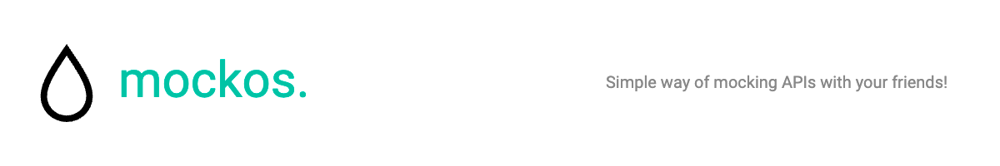

## Mockos Documentation

This is the **documentation, guides and blog for Mockos**.

Mockos is a **useful and practical tool for developers** looking to test their applications with **custom API mocks**, in a **collaborative way and without the need to install anything** on their computer.

## Deployments

- **Documentation** - https://docs.mockos.io
- **Application** - https://mockos.io

If you find any bugs/vulnerabilities feel free to open a new issue or/and contact me at undernightcore@gmail.com.

## Features

- Create API responses using a **simple JSON editor**.
- Stay in sync with other people thanks to **realtime and compare capabilities**.
- Create **multiple projects** and invite **multiple members** to help you mock API responses.
- Simplified **branch system** in case you introduce **breaking changes**.

## Run for development (only docs)

Clone the project

```bash
  git clone https://github.com/undernightcore/mockos-docs.git
```

Install dependencies

```bash
  npm install
```

Start the docs

```bash
  npm run start
```

## Roadmap

- Check what I'm working on here -> https://github.com/users/undernightcore/projects/1


## FAQ

#### What tech stack is this using?

Docusaurus.

#### How can I contribute?

Thank you! Please fork the project and submit a PR to the master branch, once approved it will automatically deploy.

## Support

For support, email undernightcore@gmail.com or my twitter @undernightcore. I will happily solve any issue that you may encounter, but first check if there is an already open one. 
