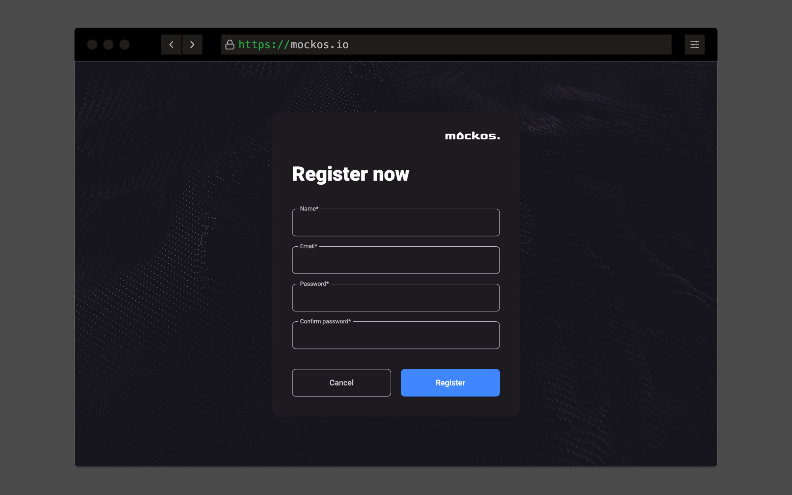

# Using [mockos.io](https://mockos.io)

Mockos.io is the **"official" way of running Mockos**. It has all the **same features** as the Self-hosted option.

### Advantages

- **No previous configuration** or Docker knowledge is required
- Already deployed **mobile and desktop apps** using PWA
- Access it from **anywhere in the world**

### Steps

#### Create an account

Head over to [mockos.io](https://mockos.io) and **create an account**. Make sure to use your _real_ email, we will send you a **confirmation email**.

#### Create your first project

From now on the **steps are the same** as the [Self-hosted option](/docs/getting-started/self-hosting).