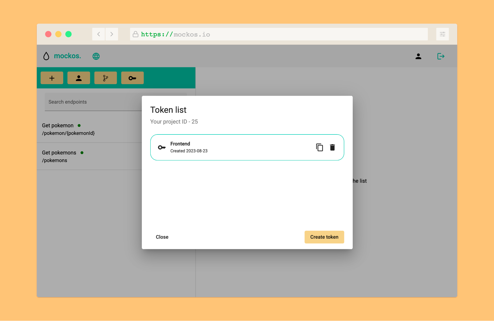

# Connecting to your mocks

**The ability to send requests to your project is a crucial step after creating your endpoints and responses in Mockos.** To achieve this, you need to follow a few steps to allow your client to connect to your Mockos project.

## Create a client token

1. Open the tokens modal in your project by clicking the "key" button in your toolbar.
2. Create a new token by selecting "Create token" and give it a name.
3. After creation, easily obtain the token by clicking the "copy" button, which will automatically copy it to your clipboard.



## Preparing the client

**All requests that you want Mockos to handle must be sent to `https://api.mockos.io/api`.**

For instance, if you wish to retrieve all Pokémon data using the `/pokemons` endpoint, the full URL would be `https://api.mockos.io/api/pokemons`.

For every request to Mockos, it's crucial to specify the project you are referring to and include the project's token you just created. These details **MUST** be included in every request using the following headers:

- **token**: The token you have just created and copied.
- **project**: Your project's ID, which can be found in the dashboard URL and tokens modal.

### Examples

Below are examples to help you connect to Mockos and begin making requests immediately. Please note that you'll need to make adjustments to suit your specific case or project.

#### JavaScript / TypeScript

```js
const response = await fetch('https://api.mockos.io/api/pokemons', {
    method: 'GET',
    headers: {
        token: 'b5cf216a2213d94aa12fae3c6cffad6000d5204e',
        project: 25
    }
}).then((data) => data.json());

console.log(response); // Pikachuuu!
```

#### Angular

```js
const proxyConfig = [
  {
    context: ['/api'],
    target: 'https://api.mockos.io',
    secure: true,
    headers: {
      project: '25',
      token: 'b5cf216a2213d94aa12fae3c6cffad6000d5204e'
    },
    logLevel: 'debug',
    changeOrigin: true,
  }
];

module.exports = proxyConfig;
```

#### Angular (behind corporate proxy)

```js
const { HttpsProxyAgent } = require('https-proxy-agent');

const proxyConfig = [
  {
    context: ['/api'],
    target: 'https://api.mockos.io',
    secure: true,
    headers: {
      project: '25',
      token: 'b5cf216a2213d94aa12fae3c6cffad6000d5204e'
    },
    logLevel: 'debug',
    changeOrigin: true,
    agent: new HttpsProxyAgent('your-corporate-proxy-info')
  }
];

module.exports = proxyConfig;
```

**Ensure that you follow these steps carefully to establish a successful connection to your Mockos project.**