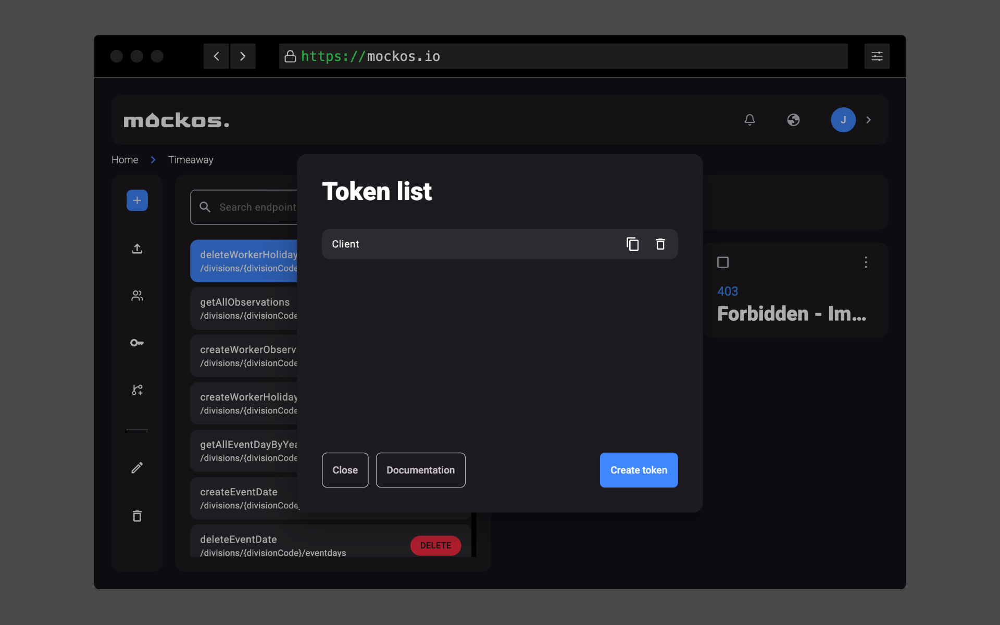

# Connecting to your mocks

**The ability to send requests to your project is a crucial step after creating your endpoints and responses in Mockos.** To achieve this, you need to follow a few steps to allow your client to connect to your Mockos project.

## Create a client token

1. Open the tokens modal in your project by clicking the "key" button in your toolbar.
2. Create a new token by selecting "Create token" and give it a name.
3. After creation, easily obtain the token by clicking the "copy" button, which will automatically copy it to your clipboard.



## Preparing the client

**All requests that you want Mockos to handle must be sent to `https://api.mockos.io/mock/{token}`.**

For instance, if you wish to retrieve all Pokémon data using the `/pokemons` endpoint, the full URL would be `https://api.mockos.io/mock/{token}/pokemons`.

For every request to Mockos, it's crucial to include the project's token you just created. These details **MUST** be included in every request:

For example, if the token is **"b5cf216a2213d94aa12fae3c6cffad6000d5204e"**, the Pokémon endpoint would be `https://api.mockos.io/mock/b5cf216a2213d94aa12fae3c6cffad6000d5204e/pokemons`

### Examples

Below are examples to help you connect to Mockos and begin making requests immediately. Please note that you'll need to make adjustments to suit your specific case or project.

#### JavaScript / TypeScript

```js
const response = await fetch(
  "https://api.mockos.io/mock/b5cf216a2213d94aa12fae3c6cffad6000d5204e/pokemons",
  {
    method: "GET",
  }
).then((data) => data.json());

console.log(response); // Pikachuuu!
```

**Ensure that you follow these steps carefully to establish a successful connection to your Mockos project.**
