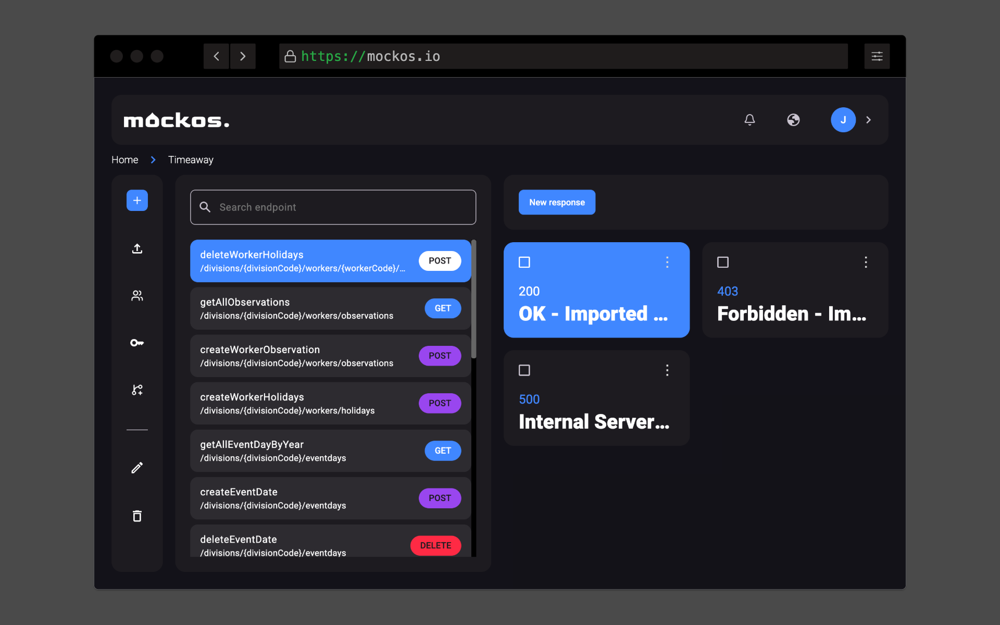

# Introduction to Mockos

Mockos is a **useful and practical tool for developers** looking to test their applications with **custom API mocks**, in a **collaborative way and without the need to install anything** on their computer.

## Features

- Create API responses using a **simple JSON/HTML editor**.
- Stay in sync with other people thanks to **realtime and compare capabilities**.
- Create **multiple projects and invite multiple members** to help you mock API responses.
- **Simplified branch system** in case you introduce breaking changes.

## How to get started

You have **two options** for using Mockos:

- Follow our [Mockos.io guide](/docs/getting-started/mockos) and **start building your APIs right away**!
- **Host it in your infrastructure** using our [Self-Hosting guide](/docs/getting-started/self-hosting).

## FAQ

### What tech stack is this using?
- **For the Frontend**: Angular, Angular Material, JSON editor, Socket.io, Luxon, Swal and Ngrx Translate.
- **For the Backend**: AdonisJS, Socket.io and PostgreSQL.

### How can I contribute?
First of all, **you are the best**! I'm **working in a contributing guide** that you can easily follow.