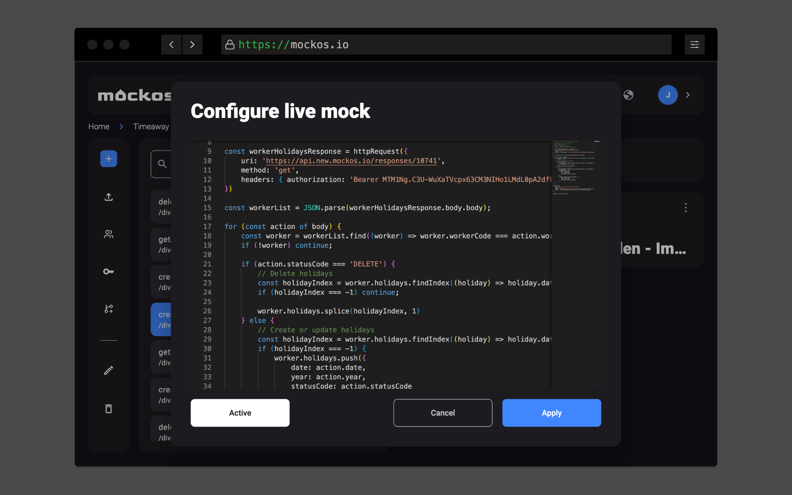

# Custom code

Mockos comes with a **JavaScript sandbox** so your mocks **aren’t just static JSON**. We call this feature **"Live Mock"**, and it is available in **response actions**.

- You can **assign a "processor"** to every response.
- It is **executed dynamically** when a client makes a request.
- It **injects request context** (headers, body, query params, etc.) from the incoming request.

## **Context Variables from the Request**

You can use the following **global variables** in your JS script to control the response behavior:

- **`queryParams`** – An object with **key-value pairs** extracted from the request’s query string.
- **`url`** – The **full request URL**, e.g., `/pokemon/78`.
- **`params`** – An object containing **dynamic URL parameters**, e.g., for `/pokemon/{pokemonId}`, `{ pokemonId: "78" }`.
- **`headers`** – An object containing all **request headers**.
- **`content`** – The **static content** stored in the response, useful for **filtering resource lists** using `queryParams` inside the processor.

## **Available Methods**

### **`httpRequest`** (Currently the only available method)

- Allows you to **call external APIs or Mockos itself**.
- Can be used, for example, to **store the result of a POST request** into another Mockos response.

## **Limitations**

- **Maximum execution time:** 2 seconds. If your code exceeds this, it will **timeout**.
- **Only V8-provided methods are available** (e.g., Array methods, basic JavaScript functions).
