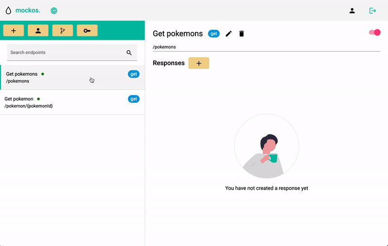

# Endpoints / routes

A project consists of **multiple endpoints**, you can think of a **project as an API**, such as the _Pokemon API_.

## Create an endpoint

Creating an endpoint can be done with **this easy steps**:

- Press the **plus button in the toolbar**.
- A popup will open asking you for a **name**, an **http method** and **your endpoint's url**.

### How does an endpoint work

An endpoint is just **the path you will be accessing your endpoint**, for example: _/pokemons_. There are **some cases** you will need to **make use of dynamic URLs** to create an endpoint.
A **dynamic URL** would be the case when **you don't know yet the full URL the client will be using**.

For example for **getting an specific Pokemon** they could be using 
- `GET /pokemons/11`
- `GET /pokemons/28`
- `GET /pokemons/98`

In this case the **Pokemon ID is dynamic**, any **dynamic values can be represented using brackets** `{}`. **What is inside** the brackets **doesn't really matter**, is just for documentation purposes.

So the endpoint would be...
`/pokemons/{pokemonId}`

You can use as **many dynamic URLs as you want**, another example could be...
- `GET /pokemons/11/attacks/30`
- `GET /pokemons/28/attacks/90`
- `GET /pokemons/98/attacks/10`

This endpoint would be...
`/pokemon/{pokemonId}/attack/{attackId}`

## Sorting endpoints

You can **sort endpoints easily by dragging them** in the list (not available in mobile devices).

### Why sorting endpoints

Sorting your endpoint in the **right order is very important**, this might **not be obvious in small projects**. When you send a request to a project it looks for the **first endpoint that matches the URL of the request**.

For example, let's say we have **2 endpoints in the following order**:

1. Get an specific pokemon `/pokemons/{pokemonId}`
2. Get all attacks of all pokemons `/pokemons/attacks`

It is **IMPOSSIBLE** to reach the second endpoint, the 'attacks' part of the path **would be confused with a Pokemon ID**.

- `GET /pokemons/1` -> 1st endpoint ✅
- `GET /pokemons/837` -> 1st endpoint ✅
- `GET /pokemons/attacks` -> 1st endpoint ❌ (should be 2nd)

This is **fixed by simply sorting**, in this case `/pokemons/attacks` should be the first one.

1. Get all attacks of all pokemons `/pokemons/attacks`
2. Get an specific pokemon `/pokemons/{pokemonId}`

- `GET /pokemons/1` -> 1st endpoint ✅
- `GET /pokemons/837` -> 1st endpoint ✅
- `GET /pokemons/attacks` -> 2nd endpoint ✅

## Configure responses

When you create an endpoint **you won't have any responses at first**, you still have to **configure a response for the endpoint to start working**.