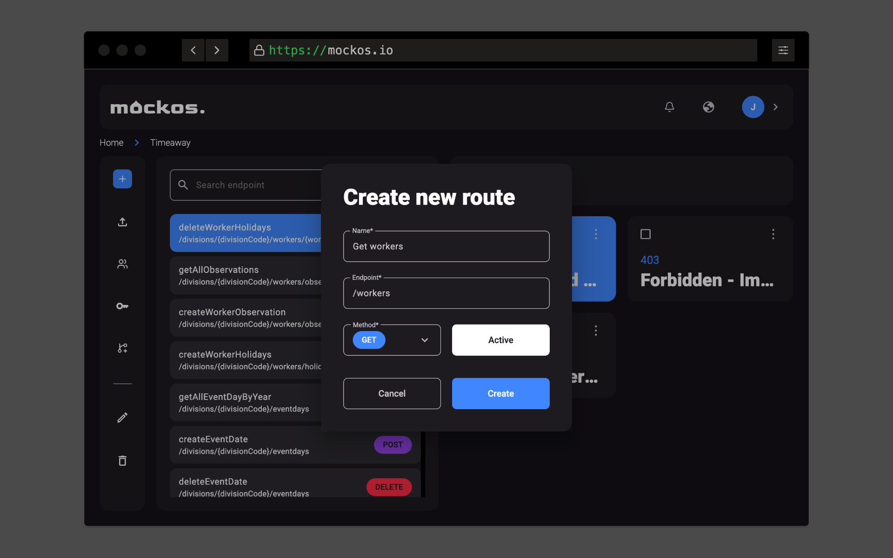
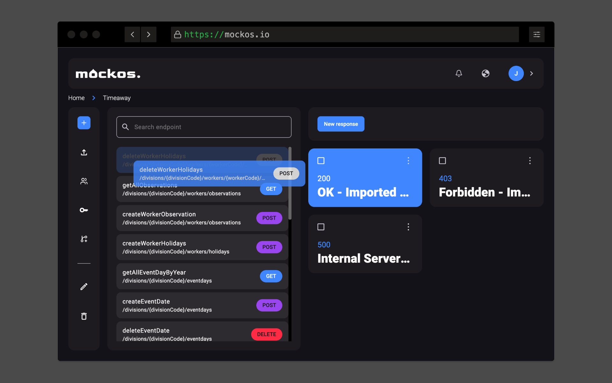

# Endpoints / Routes

A project is composed of **multiple endpoints**; envision a **project as an API**, akin to the _Pokemon API_.

## Create an endpoint

Creating an endpoint is a breeze with these straightforward steps:

- **Click the plus button in the toolbar**.
- A popup will appear prompting you for a **name**, an **HTTP method**, and **your endpoint's URL**.

### How an endpoint works

An endpoint essentially represents **the path used to access it**, for instance: _/pokemons_. In some situations, you may need to **employ dynamic URLs** to create an endpoint.
A **dynamic URL** arises when **you aren't certain about the client's complete URL**.

For instance, to **retrieve a specific Pokemon**, they might utilize:

- `GET /pokemons/11`
- `GET /pokemons/28`
- `GET /pokemons/98`

Here, the **Pokemon ID is dynamic**, and any **dynamic values can be enclosed within brackets** `{}`. The content **within the brackets is arbitrary** and serves purely for documentation.

Hence, the endpoint would be...
`/pokemons/{pokemonId}`

You can employ **as many dynamic URLs as needed**. Another instance could be:

- `GET /pokemons/11/attacks/30`
- `GET /pokemons/28/attacks/90`
- `GET /pokemons/98/attacks/10`

This endpoint would be...
`/pokemon/{pokemonId}/attack/{attackId}`

## Sorting endpoints

Effortlessly **sort your endpoints by dragging them** within the list (unavailable on mobile devices).

### Why sort endpoints?

Arranging your endpoints in the **correct order is crucial**, even if it may not be apparent in small projects. When you dispatch a request to a project, it looks for the **first endpoint that matches the request's URL**.

For example, assume we have **2 endpoints in the following order**:

1. Get a specific Pokemon `/pokemons/{pokemonId}`
2. Get all attacks of all Pokemon `/pokemons/attacks`

It is **IMPOSSIBLE** to access the second endpoint; the 'attacks' portion of the path **could be misconstrued as a Pokemon ID**.

- `GET /pokemons/1` -> 1st endpoint ✅
- `GET /pokemons/837` -> 1st endpoint ✅
- `GET /pokemons/attacks` -> 1st endpoint ❌ (should be 2nd)

This is effortlessly **remedied by sorting**, in this case, `/pokemons/attacks` should be the foremost one.

1. Get all attacks of all Pokemon `/pokemons/attacks`
2. Get a specific Pokemon `/pokemons/{pokemonId}`

- `GET /pokemons/1` -> 1st endpoint ✅
- `GET /pokemons/837` -> 1st endpoint ✅
- `GET /pokemons/attacks` -> 2nd endpoint ✅

## Configure responses

Upon creating an endpoint, you won't have any responses initially; you must still **configure a response for the endpoint to become operational**.
