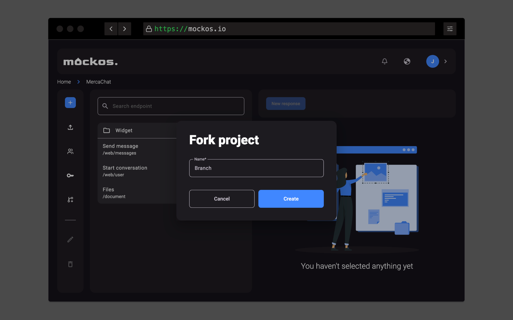

# Forking

When working in a project **you can introduce new changes** (due to contract change, etc) that **could break some clients** using those mocks.
You might **not want those changes to be effective until all clients adapt** to the APIs new structure/changes.

To solve this problem **you can create a fork for an existing project** and **make your changes without affecting the rest**.
A fork is essentially a **new project with all endpoints duplicated** and **you are it's only member**.

## Merging the changes back

Currently **there is no way to merge the changes back** to the source project other than **manually copying and pasting**.
I am still **studying what the best approach could be**. If you have **any ideas please DM me or submit a issue**!