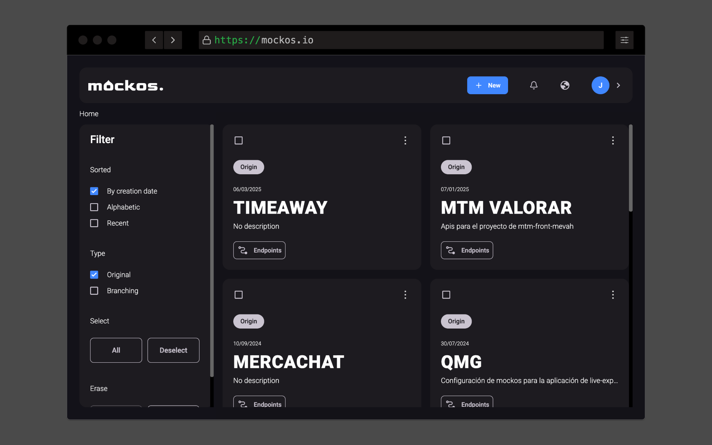
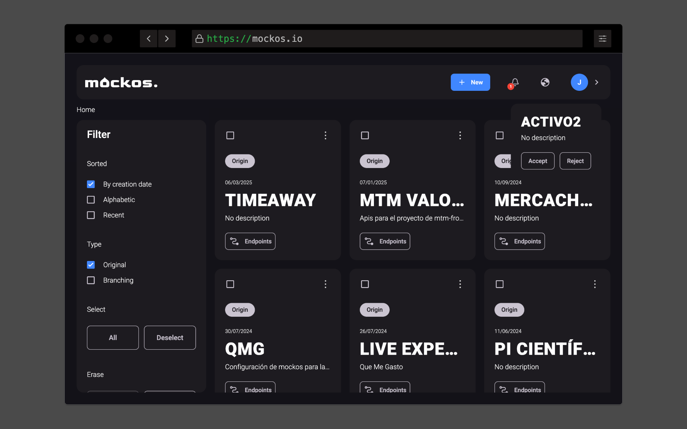

# Your first project

The **main dashboard shows all the projects you are part of**. If this is your first time **you probably won't have any to start with**, so there are **two ways** you can start mocking:

- Create your [own project](#create-your-own-project).
- Get invited to an [already existing one](#get-invited-to-a-project).

## Create your own project

Creating a project is **insanely easy**, you just follow this steps:

- **Press the plus button** inside the **"Your projects" banner**.
- A popup will open asking you for a **name and an optional description**.

## Get invited to a project

You might already **have a friend or colleague that uses Mockos** and has asked for your help. You just have to **tell your friend to** [invite you](/docs/getting-started/self-hosting).

### How to accept an invitation

- Press on the **user button** inside the **"Your projects" banner**.
- In this page will appear **all the projects you've been invited to**.
- **Press on the project card** and **confirm the request**.

## Next steps

Go ahead and **create your first routes/endpoints**...