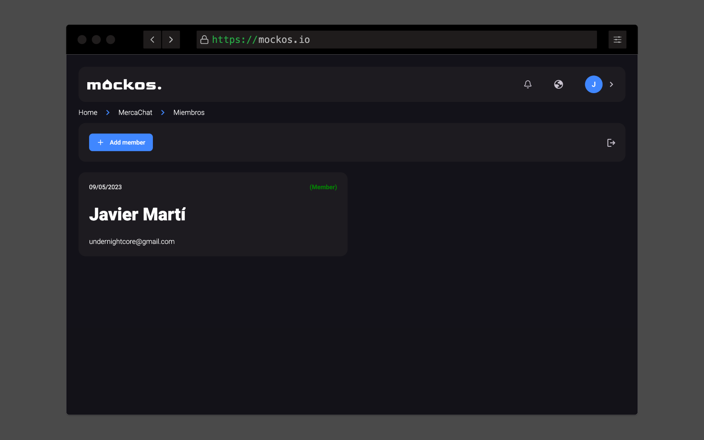
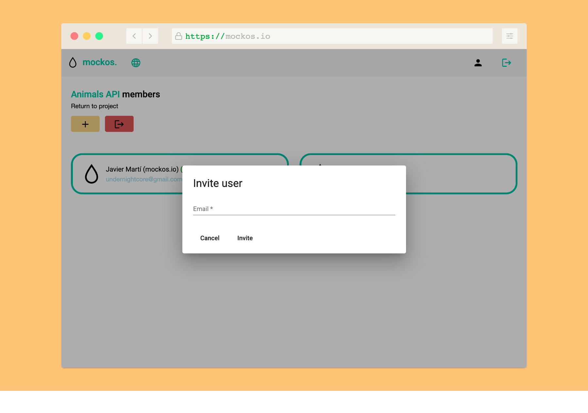

# Members

**Multiple people working in a single project** is a common scenario.

- A **(Member)** label next to someone's name signifies their **membership** in the project.
- A **(Pending)** label next to someone's name indicates that they **have not yet accepted the invitation**.

## Inviting Users

Being a **member in a project grants you the critical ability to invite others via their email addresses**.

## Leaving a Project

**Leaving a project has significant consequences**:

- You will lose the ability to edit any project elements, including mocks.
- **If you are the only member and you leave, the project will be permanently lost**.

**Please exercise caution when deciding to leave a project**.