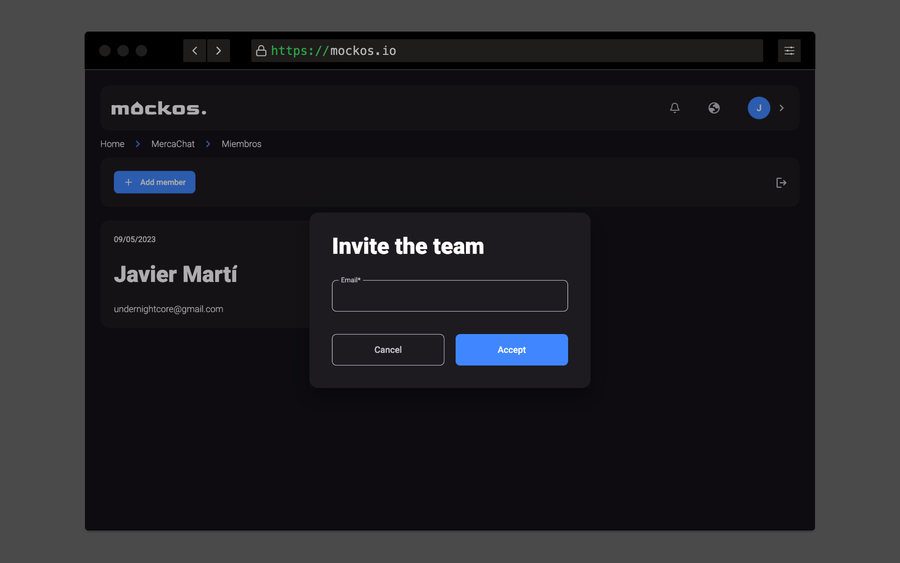

# Members

In your project, you have the flexibility to collaborate with multiple individuals. This document outlines the various aspects of managing project members effectively.

## Understanding Member Status

- **(Member)**: This designation next to someone's name indicates that they are an active member of the project.
- **(Pending)**: This designation next to someone's name means that they have been invited but have not yet accepted the invitation.

## Inviting New Users

As a project member, you have the privilege of inviting others to join your project using their email addresses.

## Leaving a Project

Leaving a project implies that you will lose the ability to edit any project content until you are invited back. Please exercise caution because if you are the only member and you leave the project, it will be permanently lost!

Keep your collaboration smooth and efficient by managing your project members wisely.