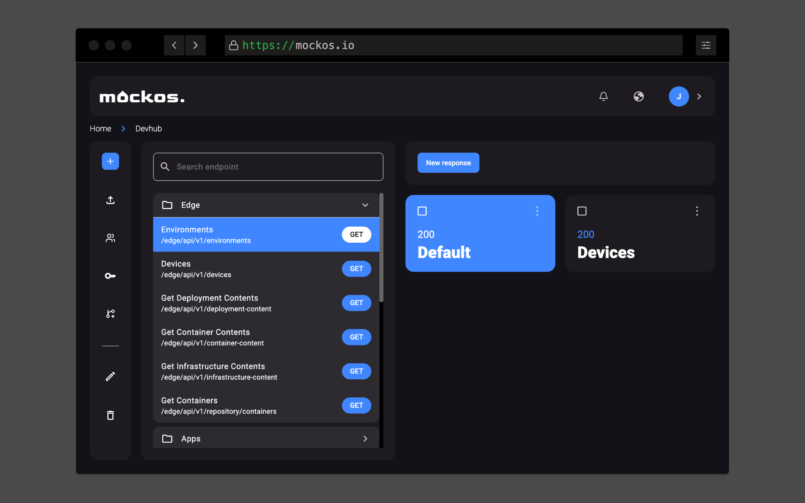
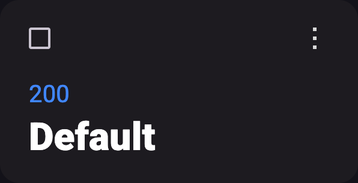

# Responses

A **response is the message an endpoint sends to a client** when the URL matches.

- An endpoint **can support multiple responses, but only one can be active** at a time.
- A response can take the form of **JSON, HTML, or any text-based content**, or even **files** (binaries)!
- You have the flexibility to **add or remove HTTP headers** to format the response as needed.

## Create a Response

Creating a response is a straightforward process:

- Simply click **the plus button next to "Responses"**.
- **Choose a unique name** for your response, specific to the endpoint or route.
- **Specify a status code** for your response.
- Populate the **body with JSON/Text or a file** using the **"File"** tab.

## Quick Actions

A response card offers **quick actions** that can be executed **without opening its modal**.

- **Swap enabled response**: This action will **enable the selected response and disable the current one** (only available for disabled responses).
- **Duplicate response**: Create an exact copy with the **same body, status code, and headers**.
- **Open the [headers modal](#custom-headers-in-a-response)**: Modify headers specifically for that response.
- **Delete response**: Keep in mind that this action is irreversible.

#### Enabled Response

#### Disabled Response

## Custom Headers in a Response

By default, **every response includes some basic headers**, but you can **add new ones or even override** the default ones! To access this modal, simply click the "&lt;&gt;" icon in a **response card**.

### "Content-Type" Header

The **Content-Type header defines** the **response body format** and the **appearance/language of the editor** in Mockos.

#### Defaults

If these headers are not overridden by custom headers, they default to the following values:

- If **"Text"** tab is selected -> `application/json`
- If **"File"** tab is selected -> `application/octet-stream`