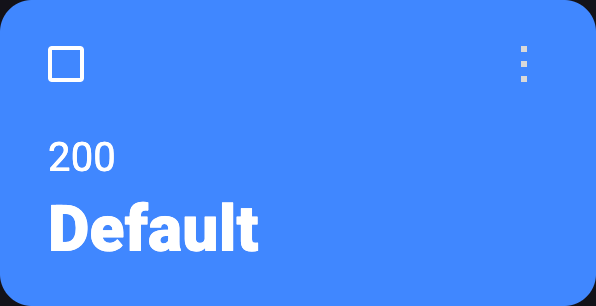

# Responses

A response is **what an endpoint sends to a client** when the URL matches. 

- An endpoint **can have as many responses as you want** but **only 1 can be enabled** at the same time.
- A response can be **JSON/HTML or any text based** response or **even files** (binaries)!
- You can **add or remove HTTP headers** that formats the response.

## Create a response

Creating a response is also very simple:

- Press **the plus button next to "Responses"**.
- **Choose a name** for your response, it must be unique per endpoint/route.
- **Set a status code** for your response.
- Fill the **body with JSON/Text or a file** using the **"File"** tab.

## Quick actions

A response card has some **quick actions** you can do **without opening it's modal**.

- **Swap enabled response**, this will **enable that response and disable the current one** (only available in disabled responses).
- **Duplicate response**, this creates an exact copy with the **same body, status code and headers**.
- **Open [headers modal](#custom-headers-in-a-response)**, you can modify headers for specifically that response.
- **Delete response**, you won't be able to recover it.

#### Enabled response

#### Disabled response

## Custom headers in a response

By default, **every response has some basic headers,** but **you can add new ones or even rewrite** the default ones! To open this modal **you just have to press the "&lt;&gt;" icon** in a **response card**.

### "Content-Type" header

The **Content-Type header determines** the **response body format** and the **appearance/language of the editor** in Mockos. 

#### Defaults

If this headers are not rewritten by a custom header **it defaults to this values**:

- If **"Text"** tab -> `application/json`
- If **"File"** tab -> `application/octet-stream`
