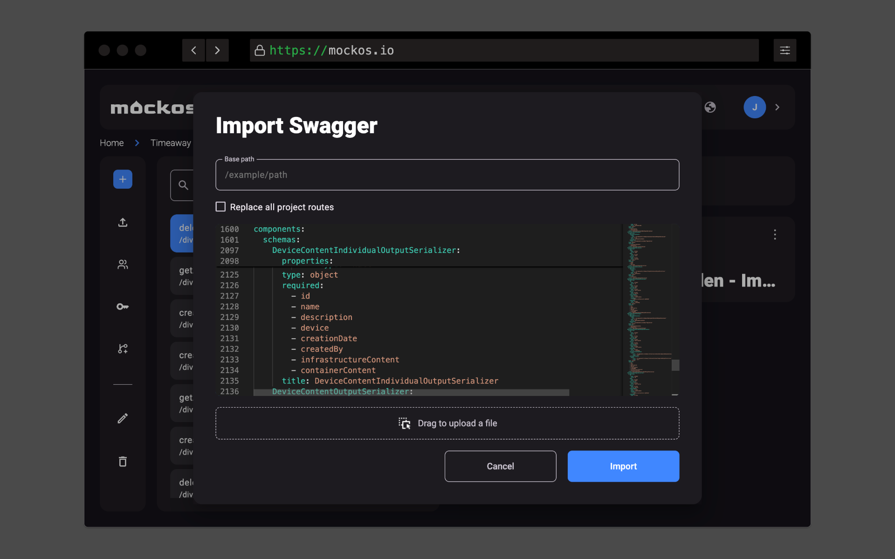

# Import Swagger

Mockos lets you **import a Swagger/OpenAPI contract** so you don't have to start your mocks from scratch.

- **Supports both Swagger and OpenAPI** in **JSON/YAML** formats.
- **Automatically creates all endpoints and responses** defined in your contract.
- If your contract **includes examples, they are auto-imported**.
- If your contract **lacks examples, Mockos generates them** based on the provided schema using **Faker.js**.

## Importing Swagger into an **existing project**

If you want to import a Swagger contract **into a non-empty project**, you have two options:

- **Replace all existing endpoints and responses** with those from the new contract.
- **Add new responses to existing endpoints** without deleting or replacing anything. This lets you decide whether to keep the old responses.
