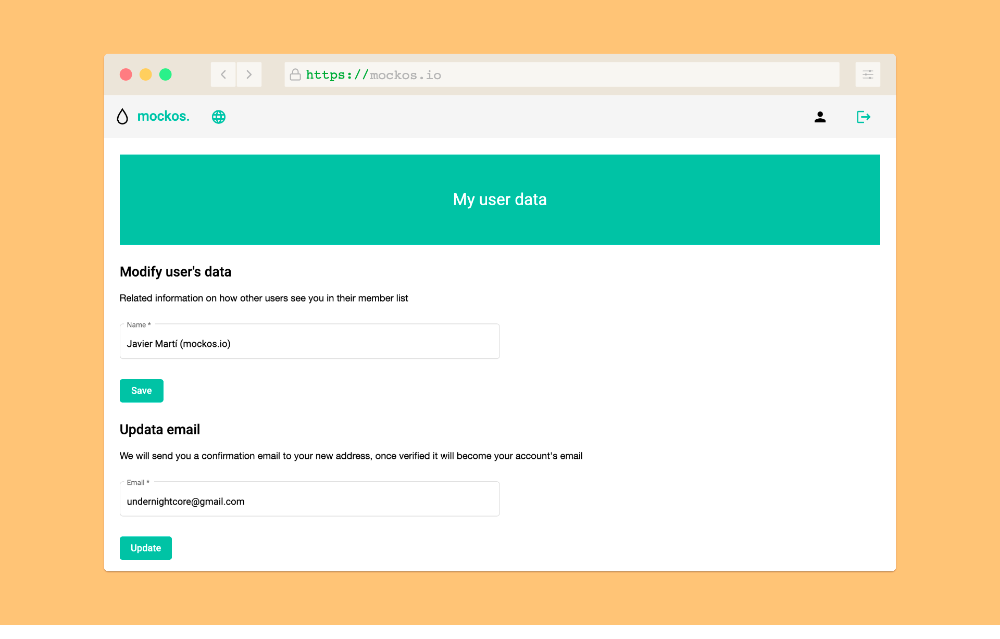

# User preferences

You have the flexibility to **customize your preferences** effortlessly by clicking the user button on the right side of the navbar, but please note that you must be **logged in** to access these settings.

## Settings List

### Name

Easily modify your name whenever you like. Please be aware that other users within the same project will be able to view your updated name.

### Email

Changing your email address involves a **confirmation step**. After submitting your new email address, you will receive an email at the provided address. Once you **confirm** it, you can begin using the new email for login. Additionally, other project members will see your updated email in the members list.
